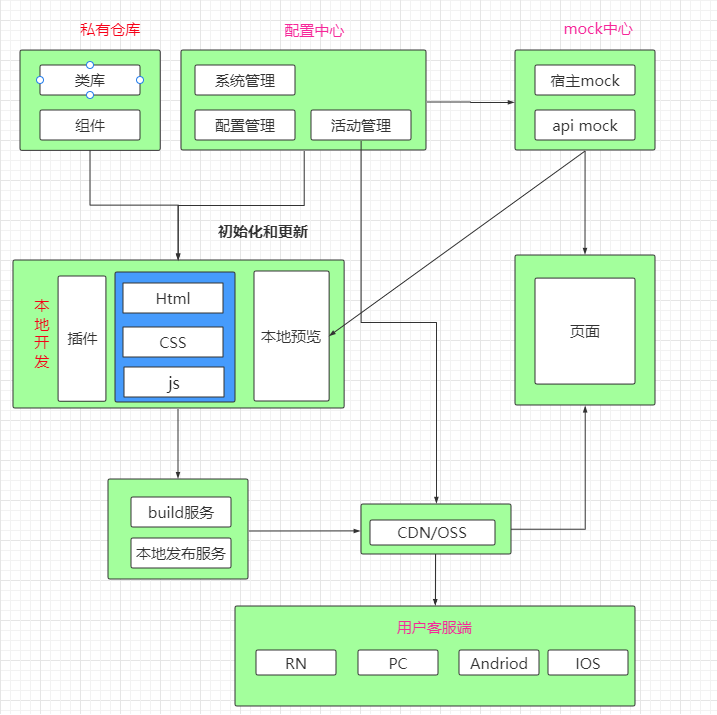

## 关于我
  没去过大厂，想做咸鱼，也想翻身。一点点喜欢编程，最害怕生气的是老婆。

### 系统

* 活动系统 - 蕤  
系统架构图

* 实时日志系统 - 獬   
  由前端日志库，消息中转服务，监控后台组成的点对点日志监控系统。

* 基于阿里云的云剪辑
* 视频内容分发系统

### 方案

* [petal-service](https://github.com/xiangwenhu/petal-service)
基于装饰器的服务框架，开箱即用，支持扩展，服务编写利器，前后端均支持。
* [asyncMessager](https://github.com/xiangwenhu/asyncMessager)   
异步通讯通用方案，异步回调转Promise通用方案。支持EventEmitter, MQTT, socket.io, iframe， webview等等场景。
* [evm](https://github.com/xiangwenhu/evm)      
事件注册监听，预警和统计， 事件监听内存泄漏排查利器！   
按需监听事件处理程序，并对重复添加进行预警，并统计你关心事件处理程序。

* [前端文件系统](https://github.com/xiangwenhu/FileSystem)     
基于indexedDB实现的前端文件系统，用于存储大型文件并且方便查看。 比如存储：视频文件，pdf文件，音频文件等等
演示地址： https://xiangwenhu.github.io/FileSystem/demo/

* [danmaku](https://github.com/xiangwenhu/danmaku)   
采用分层分片设计，把动画作用于一个片上而不是具体每个弹幕上，大幅提高性能，1200+弹幕， FPS稳定在 50+。
演示地址： https://xiangwenhu.github.io/danmu/

* [sandcastle](https://github.com/xiangwenhu/sandcastle)      
沙塔。基于配置的流程控制和爬网引擎。

* [class-error-catch](https://github.com/xiangwenhu/class-error-catch)   
基于 decorator 的错误捕捉。

* [asyncFactoryCreator](https://github.com/xiangwenhu/asyncFactoryCreator)   
异步单例。适用于同步单例。

* [nextGenerator](https://github.com/xiangwenhu/nextGenerator)   
面向next编程思想，封装下一次的调用逻辑，比较经典的场景就是setTimeout,requestAnimationFrame。调用next即进入下一个周期。

* [arrayMerge](https://github.com/xiangwenhu/arrayMerge)   
问属性路径深浅，顺序遍历，倒叙遍历都支持，高效合并数据方案

* [rloader](https://github.com/xiangwenhu/rloader)   
基于IndexedDB缓存的轻量级资源加载器。   

   演示地址：[r-loader演示](https://xiangwenhu.github.io/rloader)

* [circle-lottery](https://github.com/xiangwenhu/circle-lottery)   
该库适用指针转动或者转盘转动的转盘抽奖。不负责UI布局，仅仅负责转动效果控制。

## 工具

* [cookie-manager](https://github.com/xiangwenhu/cookie-manager)
  浏览器插件: 用户切换不是问题，保存用户cookie，随意切换，测试和\*\*好帮手。

* [swagger-to-petal-service](https://github.com/xiangwenhu/swagger-to-petal-service)
swagger转为typescript编写的的服务代码。

* [yapi-to-petal-service](https://github.com/xiangwenhu/yapi-to-petal-service)
yapi转为typescript编写的的服务代码。

* [m-tinypng](https://github.com/xiangwenhu/m-tinypng)   
基于 [https://tinypng.com/](https://tinypng.com/)的高效图片压缩工具，突破上限。

### 博客
掘金 ： [云的世界](https://juejin.cn/user/131597122679661)

[掘力计划月度榜单｜2021年10月Top作者榜公布](https://juejin.cn/post/6992851882947379214) 前端组第19名    
[掘力计划月度榜单｜2021年8月Top作者榜公布](https://juejin.cn/post/7006255145054896158)  前端第1名    
[掘力计划月度榜单｜2021年7月Top作者榜公布](https://juejin.cn/post/6992851882947379214) 前端组第6名   
[掘力计划月度榜单｜2021年6月Top作者榜公布](https://juejin.cn/post/6982444975111798798) 前端组第7名   
